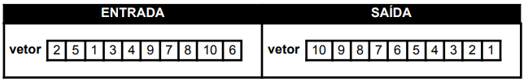
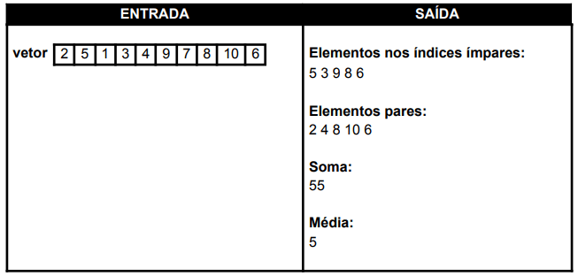

# T0-INTRO-TECH-7: Prática no Portugol

Exercícios resolvidos para a [Generation Brasil](https://brazil.generation.org/) e implementado em Portugol.

#### [Exercicio 01](ex01.por)

Dado um vetor **contendo 10 números inteiros** não ordenados, construa um algoritmo que consiga ordenar o vetor em ordem decrescente, como mostra o exemplo abaixo:

Na construção do Algoritmo, utilize os seguintes conteúdos:

- Saída de dados
- Laços Condicionais
- Laços de Repetição

 

#### [Exercicio 02](ex02.por)

Elabore um algoritmo que **leia 10 números inteiros** e armazene em um vetor. Em seguida, mostre na tela:

- Todos os elementos nos índices ímpares do vetor
- Todos os elementos do vetor que são números pares
- A Soma de todos os elementos do vetor
- A Média de todos os elementos do vetor, armazenada em uma variável do tipo real

Veja o exemplo abaixo:

